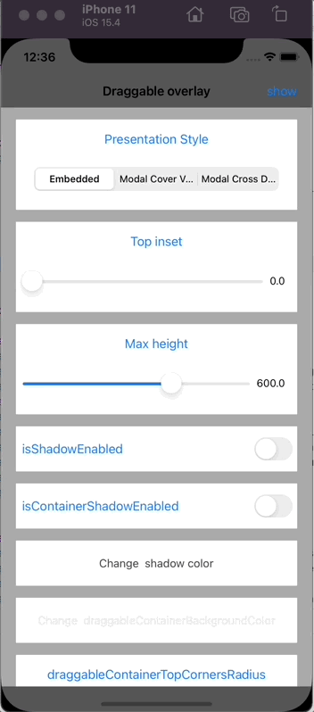
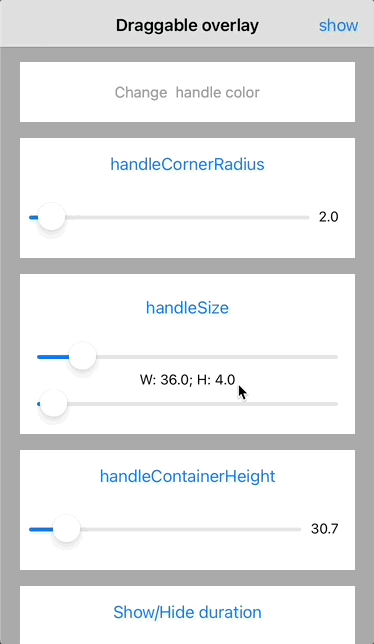
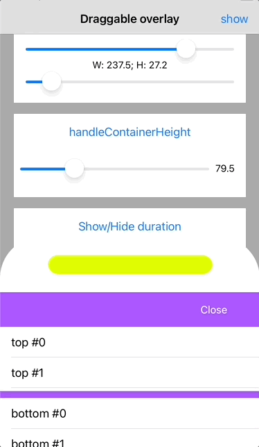
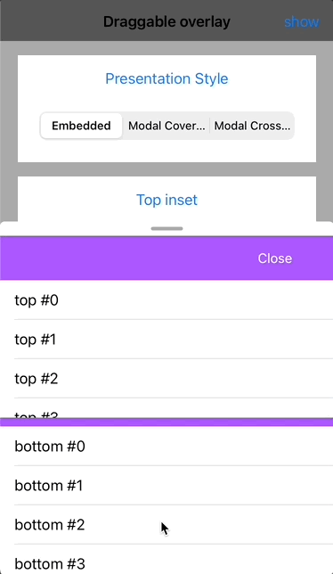

<br><br>
# DraggableOverlay


- [Requirements](#requirements)
- [Installation](#installation)
- [Usage](#usage)
- [License](#license)

A `DraggableOverlay` is a Swift library - an overlay that dynamically reveals or hides the content inside it. It can be dragged up and down to stick to predefined anchors. Whenever a drag gesture ends, the overlay motion will continue until it reaches one of its anchors.  `DraggableOverlay` has various configuration options.

`DraggableOverlay` example with default options:



`DraggableOverlay` example with enabled shadow (red color) and container shadow (green color), customized draggable container height (30 px):



`DraggableOverlay` example with custom handle corner and custom handle container corner radius, customized handle color (yellow) and changed top inset:



`DraggableOverlay` example with bounce animation:



## Requirements

- iOS 11.0+
- Xcode 11.0+
- Swift 5.0+

## Installation

### CocoaPods

To integrate `DraggableOverlay` into your Xcode project with CocoaPods, specify it in your `Podfile`:

```ruby
pod 'Shakuro.DraggableOverlay'
```

Then, run the following command:

```bash
$ pod install
```

### Manually

If you prefer not to use CocoaPods, you can integrate Shakuro.DraggableOverlay simply by copying it to your project.

## Usage
Just initilize `DraggableDetailsOverlayViewController` with your nested viewcontroller and delegate. Nested viewcontroller must adopt the `DraggableDetailsOverlayViewControllerDelegate` and `DraggableDetailsOverlayNestedInterface` protocols. The delegate allows to respond to scrolling events.
Have a look at the [DraggableOverlayExample](https://github.com/shakurocom/DraggableOverlay/tree/main/DraggableOverlayExample) (perform `pod install` before usage)

## License

Shakuro.DraggableOverlay is released under the MIT license. [See LICENSE](https://github.com/shakurocom/DraggableOverlay/blob/main/LICENSE.md) for details.

## Give it a try and reach us

Explore our expertise in <a href="https://shakuro.com/services/native-mobile-development/?utm_source=github&utm_medium=repository&utm_campaign=draggable-overlay">Native Mobile Development</a> and <a href="https://shakuro.com/services/ios-dev/?utm_source=github&utm_medium=repository&utm_campaign=draggable-overlay">iOS Development</a>.</p>

If you need professional assistance with your mobile or web project, feel free to <a href="https://shakuro.com/get-in-touch/?utm_source=github&utm_medium=repository&utm_campaign=draggable-overlay">contact our team</a>
